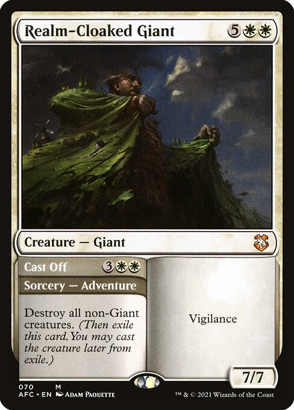
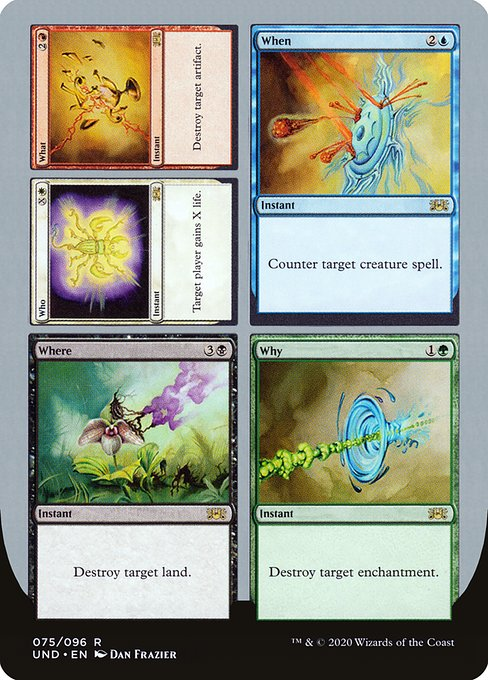
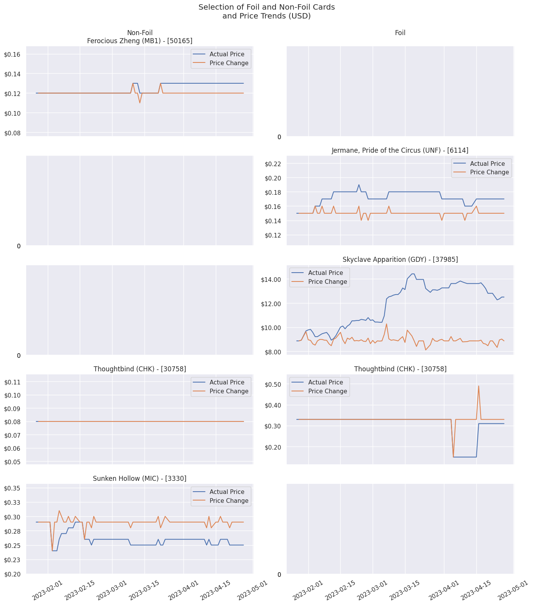
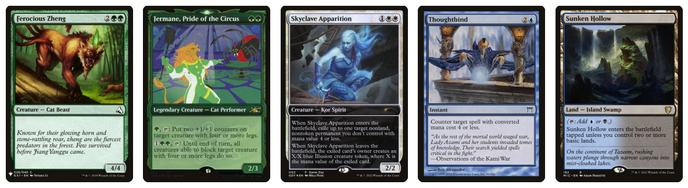

# Spell-Trends

A natural language processing analysis of Magic: the
Gathering abilities as compared to their relative
prices, foil and non-foil.


<sup>Trademarked,
[Wizards of the Coast](https://magic.wizards.com/)
</sup>

## Preface

This project takes place over the course of several
different Jupyter notebooks. While not necessary to
understanding the process and outcomes, they are
available for review at the following locations:

1. The
[Data Preparation notebook](./1_Data_Prep.ipynb)
has all of the processes used to intake, investigate,
and clean the data frome the aforementioned sources.
2. The
[Modeling notebook](./2_Modeling.ipynb)
contains all of the steps for creating and utilizing
a few different types of models.

While the original data sources are too large to be
uploaded to GitHub, a cleaned version of the data is
available in the data folder which is used in the
second notebook.

Because of the extensive and time-consuming nature of
the modeling process, all models produced by the
original data are also provided in the pickles folder.

## Project Scope and Opportunity Potential

This project will be ongoing as new data becomes
available. The initial training data was obtained on
April 25th, 2023 from multiple sources.

This project aims to create pricing predictions for
Magic: the Gathering cards based on their abilities
or "Oracle Text" as provided. The primary benefit of
this project aims to be to inform players looking to
make informed purchasing decisions, game store owners
deciding on sales patterns, and various other
collectors et al that would be interested in the
buying, selling, and/or trading of Magic cards, with a
focus on cards coming from new sets with little to no
pricing data available.

The base understanding that this operates on is that
cards that do similar things with similar payoffs,
costs, and features can be expected to have similar
values.

Magic has a lot of different working parts, so trying
to understand and investigate what goes into the
pricing of the secondary market comes with a lot of
caveats that we'll be making an attempt at detecting.

An ability to reliably predict and work with pricing
can allow drastic improvement to informed purchasing
decisions.

## Data Sources and Authority

The main dataset for this project was obtained from
[ScryFall](https://scryfall.com/)
at
[their bulk data page](https://scryfall.com/docs/api/bulk-data),
specifically the All Cards JSON file.

Data for pricing (and the data to translate back to
Scryfall usability) was obtained from
[MtGJson](https://mtgjson.com/)
at
[their download page here](https://mtgjson.com/downloads/all-files/),
specifically the "AllPrintings" and "AllPrices" files.
This data is maintained and refreshed on a dail basis,
looking back at a 90-day period. At the sources
mentioned, there is not additional data available
retroactively.

[Scryfall](https://scryfall.com)
is one of the most robust search and sorting
databases available for Magic and is used by many
different applications. They have easily and freely
available data for most cases. This data set includes
the vast majority of features that will be utilized in
this project.

While Scryfall is very robust, the pricing data that it
provides isn't quite what we want to look at. It does
feature a price column, but it's only a snapshot of a
single day and wouldn't be insulated from price spikes.
While, in theory, this data could be collected daily
over the course of weeks or months, this also isn't
held historically. Because of this, we'll utilize
[MtGJson](https://mtgjson.com)
and the available "All Prices" data set that is
available there, as it contains prices from a 90-day
period, which should allow us to better insulate from
random spikes in prices.

In order to pair our data sets together, we need to get
the card IDs from the All Prices data set and get the
related Scryfall ID for each card. For this, we need
to use another data set from
[MtGJson](https://mtgjson.com)
that has all of the IDs that may be related to a card.

The prices available in both the Scryfall data and the
MtGJson data that we'll be looking at are prices from
[TCGPlayer](https://tcgplayer.com),
specifically the "Retail" or market prices. These
prices are made up of the mean prices of actual sales
that are made on the platform rather than the prices
that cards are listed at. Since TCGPlayer is the
largest online marketplace for Magic cards in the
United States, this data should be some of the most
accurate available.

The data from
[MtGJson](https://mtgjson.com)
also has prices from Card Kingdom, CardMarket, and some
others, but these prices are usually notoriously
higher, for foreign markets, or otherwise less
available for various reasons.

Additionally, the pricing data we're looking at will
only be for paper Magic, at least for the initial scope
of this project, though MtG:O pricing may be a target
at a later date.

As for my own authority on this data, I've been an avid
Magic player for almost a decade at this point. I've
been consistently buying and trading cards since early
2014 and have had several interpersonal relationships
with people that have made a business of the Magic
market in all categories of it.

## Data Preparation

There are several steps that need to be taken in order
for this project to be at a point where all of our data
sets are in the same format and where all of our data
is able to even be processed.

### The Need to Translate

Data from MtGJson and data from Scryfall are both
stored differently. Scryfall stores their data in a csv
format that is structured more like a standard
database, whereas MtGJson - as the name implies -
stores their data in a json format.

Additionally, MtGJson and Scryfall have different IDs
that each card uses.

Fortunately, MtGJson has Scryfall ID as an item for
each card.

*Un*fortunately, this ID isn't stored with the card
price data.

In order to put this data together, we need to match
every UUID from MtGJson with a Scryfall ID, that's what
the 'AllPrintings' file is for.

While it has a lot of other information, we'll be using
the much more standardized Scryfall data for that. All
we need is the UUID and ScryfallID tags and we can
create a simple translator.

### Pairing Pricing Data

As mentioned, our Scryfall Data has prices for exactly
1 day. Since this makes our data susceptible to random
spikes, we want to instead use the MtGJSon prices,
which are maintained through daily rolling updates and
keep 90 days worth of prices. We can use the median of
these prices to create our target, and we can insulate
ourselves further from spikes in data by using the
market or "retail" prices and only look at the actual
sales means that took place over that 90-day period.

### Feature Selection

Once we have our pricing data paired together, we can
start pairing down our data to the information we
actually care about.

Below is a table outlining each of the features used
from the Scryfall data set alongside a reason for their
inclusion.

| Feature Name | Purpose Served |
| ---: | --- |
| Release Date | Used to calculate the age of a card. |
| CMC | The "cost" of a card. This is the sum of all mana symbols. Cards that are harder to cast may be worth lower amounts because of this difficulty. A card that has a high CMC needs to be extra strong to be priced higher. |
| Type Line | Different card types have different impacts and restrictions on how they work. Sorceries and Creatures that do similar things can be worth vastly different amounts. |
| Oracle Text | This is the bulk of explaining how a card works. This is used to describe what a card actually *DOES* when it's used. We'll use the oracle text of a card for a large portion of our data. |
| Power/Toughness | These features only apply to creatures and vehicles. These determine how "strong" a creature is. A big predictor in whether or not a card is usable in Modern, for instance, is whether or not it dies to Lightning Bolt, which is a card that deals 3 damage to any target. |
| Color Identity | This is an explanation of what "color" a card is. Commander, one of the most popular formats at this time, relies heavily on color identity to determine what decks a card can be played in. |
| Promo/Reprint | These are special printing indicators of a card. A card that is a promo is usually printed at a lower capacity and a card that is a reprint is just an existing card that is being printed again. Generally, promos have a higher value and reprints have a lower value, they are effectively opposites of each other, but promos are generally reprints in and of themselves. |
| Full Art/Textless | Just like promos, these are special printings of other cards. Both of these are also generally types of promos. |
| Number of Abilities | A card that does 1 thing can be good. A card that does 8 things can be great. |

### Special Cases

Because of how we're observing our data, there are a
few things that were problems when bringing in
everything.

One prominent issue was the presence of multi-part
cards.

These cards generally have two separate ways to cast
them. This can be something like *Realm-Cloaked Giant*,
which can also be cast as *Cast Off*. In effect, this
is two completely different cards, just on the same
piece of cardboard.



While this kind of card has become more common in the
last few years, There are only about 1,050 of them
total. There's an even more special case from one of
the "UN"sets that appears in our data 5 times.

While this card is excluded from our main data because
it isn't representative of our data set at large, it is
an interesting card to mention.



Because these cards are stored as multiple entries and
generally stored differently in our Scryfall data than
any other card, we'll ignore these for now. In theory,
an exception could be made for these but the time sink
would far outweigh the benefit at this point.

### Subset Selection

Now that we have a good idea of what to account for, we
need to narrow our scope. This was briefly hinted at
earlier in the project, but there are a lot of cards
that exist outside of what TCGPlayer pricing is good at
capturing or are generally not representative of the
primary game.

The table below outlines each reduction step, its
justification, and the resulting number of cards
remaining in the data set after the step's completion.

| Step | Explanation | Cards Remaining |
| ---: | --- | :---: |
| **Before** | ... | **415,580** |
| **English-Only** | TCGPlayer's prices are primarily geared toward the English-speaking North America market. | 80,033 |
| **No Oversized** | These are special printings of regular cards that cannot be played in a normal game of Magic | 79,470 |
| **None of**: Token, Emblem, Scheme, Vanguard | These are also special cards that cannot be played but are not regular cards | 77,435 |
| **Only Paper** | TCGPlayer does not track MTG:Online prices and the MTGO market is an entirely different market from the paper one. | 69,414 |
| **No Silver- or Gold-border Cards** | Silver and Gold border cards are cards from either joke sets or collector-only sets that cannot be used in a normal game, even though they are otherwise normal cards. | 67,533 |
| **Only Cards With a Type** | Some cards in the data have no type listed. All legal, playable cards have card types. | 67,520 |
| **No CMB1 or CMB2 Cards** | These are cards that were special, playtest cards that were released to the public and never meant to be played in any format. | 67,280 |
| **No Multi-Cards** | As described before, these cards simply do not work without special processing. | 65,169 |
| **Only Cards With Prices** | We are training a model to predict prices. Many of the cards that don't have prices are cards that simply haven't made a sale in months. These cards can be either do-nothing cards that are listed at $0.03 or are extremely powerful and unique cards listed at hundreds of thousands of dollars. This discrepancy makes it nigh impossible to impute this data. | 64,250 |
| **Remove Low-Count "Sets"** | There are several sets that only contain a handful of cards because of the way promos used to be handled. While these cards may be worth looking at in the future, their extremely abnormal nature makes it difficult to account for. | **62,370** |

### Card Name Regularization

Because our investigation is going to be focusing on
NLP to generate prices, we need to make sure that this
data contains consistent information. One strategy for
doing this that's employed by most Magic applications
is to replace the name of a card with CARDNAME whenever
it appears in its own text.

For example, Skyclave Apparition has an ability that
says:

> When Skyclave Apparition enters the battlefield...

Abilities like this are common in Magic, but in order
for us to be able to reliably catch that, we would need
to have each card's name treated the same way, since no
other cards reference Skyclave Apparition in their
abilities. For example, we would translate this card's
ability to start with:

> When CARDNAME enters the battlefield

### Pricing Visualization

While not, strictly speaking, a part of the preparation
process, it is important to understand just how
different pricing data can be between cards. Some cards
can fluctuate wildly in price, changing by several
dollars in just a few days. Some may keep a constant
price for years on end. Some cards can be orth hundreds
of dollars and some cards can barely be worth pennies.

This fluctuation is what we're trying to capture in the
upcoming steps.





## Model Preparation

With our data cleaned and pre-processed, we need to
convert it from generally human-readable data into data
that can be interpreted by a learning model.

### Processing Abilities

The data provided from Scryfall has our abilities as
text, which is great for readability - but our model
needs this data to be vectorized for it to be usable.

Additionally, our cards can have multiple abilities.
These abilities are denoted by `\n` in the text, which
means that we are able to actually split from a single
line of text into several abilities. Once we do that,
we can then split from our list of abilities into our
fully vectorized data. This will effectively take our
abilities, turn them into chunks of data, and then for
each card in our data it will assign it as either
having that phrase or not having that phrase.
Additionally, when we have our abilities split out we
can assign each card a value of how many abilities it
has.

### Additional Vectorization

While our abilities make up the largest portion of our
vectorized data, we also need to vectorize a few other
pieces of data.

- Color Identity
  - This can be have 6 total items, with many cards
  having multiple values.

- Power, Toughness, and Loyalty
  - While these are all understandable as numbers,
  there are special values in each of them that can't
  be treated as numbers in our data set.
  - Additionally, it's important to note that our model
  won't be able to interpret "None" as an integer, and
  we can't convert it into a 0 because there are cards
  that have 0 as a value, but cards with None as a
  value outright don't have a power, toughness, or
  loyalty.

## Data Subsetting

Foil and non-foil prices can vary wildly for each card.
As well, there are many cards that may have foil prices
but not non-foil prices - like many promos - and the
same is true for the other way around - like cards that
are older than the foiling process.

This means that we'll actually have 2 different models
predicting the foil and non-foil prices.

## Modeling

### Creating the Dummy Model

To get a solid baseline, we need to create a dummy
model that will show a no-effort approach to prediction
so that we can see if our efforts are actually making
any kind of reasonable progress. To do this, we'll just
take the median price of cards across each of our data
subsets and use those to predict the value of any given
card.

We'll be using root mean squared error as a means of
measuring the effectiveness of our predictions. This
will show us the average distance that are predictions
are from the true values.

| Subset | Prediction | RMSE  |
| ---:   | :---:      | :---: |
| Normal | $0.90      | 91.61 |
| Foil   | $0.22      | 47.28 |

Unsurprisingly, guessing a middle value arbitrarily for
every single card blindly isn't very effectual.

As long as we're able to beat these values, we can show
that we've made progress in the right direction.

### Model Methodology, Testing, and Selection

a

<!-- MODELING -->
<!-- Demonstrate an iterative approach -->
<!--   +Run/interpret a dummy model -->
<!--   +Introduce new models that improve -->
<!--   -Explicitly justify model change w/
        results and context -->
<!--    -Explicitly describe improvements -->

## Conclusions

As it stands, our model is doing okay overall. A lot of
predictions are within $1 of the actual prices. It
looks like a big part of that is because of how many
cards are low cost in the first place. The model is
picking up on this and is sticking a lot of predictions
on the low end - which isn't necessarily a bad thing.
Having an estimate on the lower end of things is safer
for people looking to invest in the cards, but low risk
generally means low reward.

In all cases, our RMSE score is showing some overfit,
and since our selected model is a Random Forest
Regressor, this is not very surprising.

Currently, the model is probably at a state where it's
helpful for gauging cards and prices that sit above
what may be a lower-price card, but precise and
accurate prices aren't really in the picture just yet.
Even with that as a point, there are a decent number of
predictions that are substantially higher than their
actual prices, though this is a lot less common on the
foil data set. This is likely due to the presence of
things like the reserved list, which consists almost
entirely of cards that aren't foil, a large chunk of
which do very little as far as modern game standards
are concerned, and even more are priced astronomically
higher than even some of the best cards by today's
standards.

## Next Steps

While this model doesn't quite meet the needs that were
originally put forth, there seems to be a real,
possible task to undertake.

As mentioned at the very beginning of this project,
there will be more updates as more information comes
out, however infrequent they may be. With new sets
coming out with relative frequency, the data will
constantly be evolving.

Below are some steps that are on the docket for model
improvement in no particular order.

- **Model Tweaking**
  - The model is currently overfitting to our data to
  some degree. There are a lot of different parameters
  that could be searched across to potentially improve
  upon this.

- **Different Modeling Methods**
  - This project primarily looked to try only a handful
  of modeling methods. Elastic Net, Random Forest, and
  Gradient Boosting. There exist other options that may
  be worth looking into and might have impressive
  results. Even using the same models but with
  different parameters could produce some promising
  data.

- **Narrowed Scope**
  - While many cards were left out and our scope was
  reduced drastically, things like the reserved list,
  the sheer amount of commons and uncommons that aren't
  worth more than pennies, and cards with no abilities
  may be playing an even more drastic role under the
  hood than we can even begin to guess. Reducing our
  training data to look more specifically at the data
  that is outside of those sets may be worth a shot.

- **Further Subsetting**
  - Separating the cards out into foil and non-foil was
  one of the most important parts of the training data
  processing. It may be of use to take the cards down
  even further based on different features like card
  type if possible, though this may only lead to more
  complexity for no reason.

- **Accounting for Modal or Multi-Cards**
  - There was an entire subset of cards that had to be
  ignored in order for our processing to even function.
  As new sets come out, these cards are going to only
  become more abundant. Making an exception that takes
  cards like this into consideration may be a vital
  part of the process before too long.

- **Create an Uploader/Importer**
  - It's nice to see the data and how it's laid out
  now, but it would be extremely useful to be able to
  import new set data as it becomes available before
  release to be able to more quickly gauge a set's
  value. This may be something that can be put off
  until the model itself is performing with much better
  predictions, but it is still extremely important that
  this is done at some point.

## For Inquiries, Business or Otherwise

| Contact Type | Contact Info |
|---:|:---|
| GitHub | [github.com/ParkedHampster](github.com/ParkedHampster) |
| eMail | [jd@jmentz.com](mailto:jd@jmentz.com) |

## Repository Structure

```bash
Spell Trends
├── 1_Data_Prep.ipynb
├── 2_Modeling.ipynb
├── _code
│  ├── __init__.py
│  ├── __pycache__
│  ├── card_selection.py
│  ├── cleaner.py
│  └── viz.py
├── data
│  ├── AllPrices.json
│  ├── AllPrintings.json
│  ├── ScryfallData.json
│  └── simplified_cards.parquet
├── img
│  ├── MTG_Primary_LL_2c_Black_LG_V12.png
│  ├── pricing_trends.png
│  ├── realm_cloaked_giant.jpeg
│  ├── trend_cards.png
│  └── who_what_when_where_why.jpeg
├── LICENSE
├── pickles
│  ├── foil_gs.pkl
│  ├── log_foil_gs.pkl
│  ├── log_norm_gs.pkl
│  └── norm_gs.pkl
├── README.md
└── Spell Trends Presentation.pdf
```

<!-- CONCLUSIONS -->
<!-- EVALUATION -->
<!-- +Show how well a model solves the problem -->
<!--    +Justify choice of metrics and 
        consequences -->
<!--    +Identify final model using those
        metrics -->
<!--    +Discuss the implications -->

<!-- GITHUB REPO -->
<!--    Conclusion summarizes implications -->

<!-- +CODE QUALITY - NOT PART OF README -->
